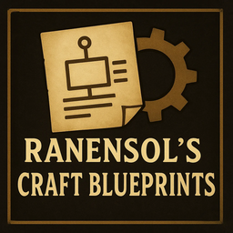

<p align="center">
  
</p>

# Aska - Ranensol's Craft Blueprints


A BepInEx mod for ASKA that allows you to create custom crafting recipes using simple JSON files.

## Features

- 🌐 Works in single-player, multiplayer, and with villager task assignments
- ✨ Create custom crafting recipes without coding
- 🔧 Simple JSON configuration
- 📋 Automatic reference file generation for relevant in-game items
- 🎮 Works with most crafting stations (Workshop, Weaver, Player Inventory, etc.)
- 🔄 Hot-reload support - just edit JSON and restart the game

## Installation

### IMPORTANT

1. **Always backup your local save game and (if applicable) your server save game before you do anything with any mod** 


### Prerequisites

1. **Install BepInEx 6 (IL2CPP)** if you haven't already:
   - Download the latest **IL2CPP** build from [BepInEx builds](https://builds.bepinex.dev/projects/bepinex_be)
   - Extract the contents to your ASKA game folder (where `ASKA.exe` is located)
   - Launch the game once to initialize BepInEx, then close it

### Installing the Mod

2. **Download this mod** from the [Releases](../../releases) page
3. **Extract** the mod files to `BepInEx/plugins/` folder
4. **Launch the game** - config and recipe files will be generated automatically

Your folder structure should look like:
```
ASKA/
├── ASKA.exe
├── BepInEx/
│   ├── plugins/
│   │   └── Ranensol.BepInEx.Aska.CraftBlueprints/
│   │       ├── Ranensol.BepInEx.Aska.CraftBlueprints.dll
│   │       ├── Recipes/
│   │       └── Reference/
│   └── config/
└── ...
```

## Usage

### For Players

The mod comes with 5 example recipes to get you started. On first launch, you'll find these files in `BepInEx/plugins/Ranensol.BepInEx.Aska.CraftBlueprints/`:

**Recipes folder:**
- `Examples.json` - Example recipes you can learn from
- `CustomRecipes.json` - Empty file for your own recipes

**Reference folder:**
- `Items.txt` - All available items in the game
- `MenuLists.txt` - All crafting station menus
- `Stations.txt` - All crafting stations
- `Categories.txt` - Blueprint categories
- `Rules.txt` - Unlock conditions

### Configuration

Config file: `BepInEx/config/com.ranensol.aska.craftblueprints.cfg`

```ini
[Files]
CreateExampleFile = true      # Create Examples.json on launch
CreateCustomRecipeFile = true # Create CustomRecipes.json on launch
DumpReferenceFiles = true     # Create reference files on launch
```

Set any option to `false` to disable file creation.

## Creating Custom Recipes

### Basic Recipe Structure

Create or edit `CustomRecipes.json`:

```json
{
  "recipes": [
    {
      "id": 900000100,
      "resultItem": "Item_Materials_Linen",
      "name": "My Custom Recipe",
      "ingredients": [
        {
          "item": "Item_Wood_BarkFibres",
          "quantity": 10
        }
      ],
      "quantity": 1,
      "menuLists": ["WeaverBlueprints_T1"],
      "rules": ["Weaver_Rule"],
      "interaction": "WeaverInteraction",
      "category": "Categ_Blueprints_Materials",
      "description": "Craft something useful",
      "lore": "Optional flavor text"
    }
  ]
}
```

### Recipe Fields Explained

| Field | Required | Description |
|-------|----------|-------------|
| `id` | ✅ Yes | Unique ID for this recipe (use 900000000+) |
| `resultItem` | ✅ Yes | The item you want to craft, use values from `Items.txt` |
| `name` | ✅ Yes | Display name in crafting menu |
| `ingredients` | ✅ Yes | Items and quantities needed to craft this item, use values from `Items.txt` |
| `quantity` | ✅ Yes | How many items this recipe produces |
| `menuLists` | ✅ Yes | Which crafting menus show this recipe (from `MenuLists.txt`) |
| `rules` | No | Unlock conditions, e.g. Workshop Tier 2 (from `Rules.txt`) |
| `interaction` | ✅ Yes | Which crafting station this item can be created in (from `Stations.txt`) |
| `category` | ✅ Yes | Blueprint category (from `Categories.txt`) |
| `description` | No | Short description shown in-game |
| `lore` | No | Flavor text shown in-game |

### Important Notes

- **Recipe IDs must be unique** across all your JSON files
- **Use IDs starting from 900000001** to avoid conflicts
- Item names, menu lists, stations, etc. must exactly match names in the reference files
- Multiple JSON files are supported - create as many as you want in the Recipes folder
- In multiplayer all clients and the server must have the same recipe json files

### Common Crafting Stations

| Station | Interaction Name |
|---------|-----------------|
| Player Inventory | `VirtualCraftingStation` |
| Workshop | `WorkstationInteraction` |
| Weaver | `WeaverInteraction` |
| Leatherworker | `LeatherworkerTableInteraction` |

Check `Stations.txt` for the complete list.

## Troubleshooting

**Recipes not appearing in game:**
- Check the BepInEx console for error messages
- Verify all item names match those in `Items.txt` exactly
- Ensure your recipe ID is unique
- Make sure the crafting station exists in your game
- Make sure you have met the rules requirements

**Reference files not created:**
- Check that `DumpReferenceFiles = true` in the config
- Launch the game at least once

**Config file not appearing:**
- Launch the game at least once with the mod installed
- Check `BepInEx/config/` folder

## Example Recipes Included

The mod ships with 5 example recipes:
1. **Linen Cloth** - Craft linen at the Weaver
2. **Linen Thread** - Craft thread at the Weaver
3. **Leather Hide** - Stitch scraps at the Leatherworker
4. **Simple Torch (Fish Oil)** - Alternative torch recipe at Workshop
5. **Simple Bow** - Craft bows from inventory

These are meant as learning examples - feel free to disable them in the config and delete the Examples.json.

## Support

Found a bug or have a suggestion? Open an issue on GitHub!

## Building from Source

### Prerequisites
- Visual Studio 2022 or later
- .NET SDK
- ASKA installed with BepInEx 6 (IL2CPP)

### Setup

1. Clone the repository
2. Copy `GamePaths.props.example` to `GamePaths.props`
3. Edit `GamePaths.props` and set `<GameFolder>` to your ASKA installation directory
4. Open the solution in Visual Studio and build

The project uses `GamePaths.props` to reference game assemblies, so each developer can maintain their own game path without modifying the main project file.

### Project Structure

The mod uses a clean architecture with separation of concerns:
- **Recipes/** - Recipe loading and validation
- **Blueprints/** - Blueprint creation and game integration
- **GameData/** - Game resource management
- **FileIO/** - File operations
- **Patches/** - Harmony patches

## Credits

Created by Ranensol

## License

MIT License - See LICENSE file for details